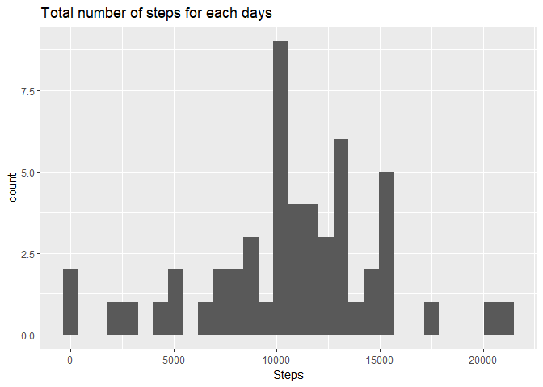
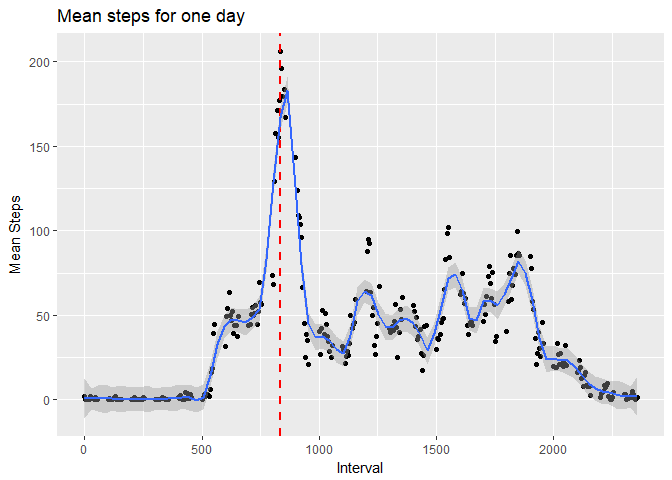
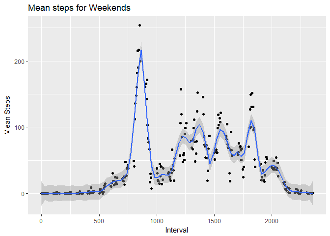

## Loading and preprocessing the data
First, make sure the data had been downloaded and put into the Working Directory  
Read the activity.csv using read.csv function


```r
#Read the activity.csv after this file was put into the working direction
Activity <- read.csv("activity.csv")

#Omit the data with no missing values
Activity_omit <- na.omit(Activity)
```

And we could take a glance of these two data, especially on NA's.


```r
summary(Activity)
```

```
##      steps                date          interval     
##  Min.   :  0.00   2012-10-01:  288   Min.   :   0.0  
##  1st Qu.:  0.00   2012-10-02:  288   1st Qu.: 588.8  
##  Median :  0.00   2012-10-03:  288   Median :1177.5  
##  Mean   : 37.38   2012-10-04:  288   Mean   :1177.5  
##  3rd Qu.: 12.00   2012-10-05:  288   3rd Qu.:1766.2  
##  Max.   :806.00   2012-10-06:  288   Max.   :2355.0  
##  NA's   :2304     (Other)   :15840
```

```r
summary(Activity_omit)
```

```
##      steps                date          interval     
##  Min.   :  0.00   2012-10-02:  288   Min.   :   0.0  
##  1st Qu.:  0.00   2012-10-03:  288   1st Qu.: 588.8  
##  Median :  0.00   2012-10-04:  288   Median :1177.5  
##  Mean   : 37.38   2012-10-05:  288   Mean   :1177.5  
##  3rd Qu.: 12.00   2012-10-06:  288   3rd Qu.:1766.2  
##  Max.   :806.00   2012-10-07:  288   Max.   :2355.0  
##                   (Other)   :13536
```

## What is mean total number of steps taken per day?
We add the 'steps' colunm by each date to find out the total number of steps taken per day.


```r
#Calculate the total number of steps taken per day
act_sum <- aggregate(Activity$steps, by = list(Activity$date), sum)
names(act_sum) <- c("Date", "Steps_sum")

#Plot the histogram of the total number of steps taken per day
library(ggplot2)
g <- ggplot(act_sum, aes(Steps_sum))
g + geom_histogram(na.rm = TRUE) + 
        labs(title = "Total number of steps for each days", x = "Steps")
```

```
## `stat_bin()` using `bins = 30`. Pick better value with `binwidth`.
```

<!-- -->

```r
#Calculate and print the mean and median of the total number of steps taken per day
act_mean <- mean(act_sum$Steps_sum, na.rm = TRUE)
act_median <- median(act_sum$Steps_sum, na.rm = TRUE)
```

And we calculate the mean total number of steps is 1.0766189\times 10^{4}, the median number of steps is 10765.

## What is the average daily activity pattern?
Here we use the Activity_omit as the working data, whose missing value had been removed previously.  
We calculate the mean steps by each interval and plot a smooth line onto the dot pattern


```r
#Calculate the mean steps taken per 5 minutes in each day
interval_mean <- aggregate(Activity_omit$steps, by = list(Activity_omit$interval), mean)
names(interval_mean) <- c("Interval", "Mean_Steps")
interval_mean$Interval <- as.numeric(as.character(interval_mean$Interval))
interval_mmax <- interval_mean$Interval[interval_mean$Mean_Steps == max(interval_mean$Mean_Steps)]

#Plot the mean steps taken per 5 minutes in each day and the max step line
g <- ggplot(interval_mean, aes(x = Interval, y = Mean_Steps))
g + geom_point() + 
        geom_vline(xintercept = interval_mmax, col = "red", linetype = 2, lwd = 1) +
        geom_smooth(method = "loess", span = 0.1) +
        labs(title = "Mean steps for one day", x = "Interval", y = "Mean Steps")
```

<!-- -->

We could also find and plot the max steps in daily activity pattern as the red dash line.  
The maximum step in daily activity pattern is 835

## Imputing missing values
The Activity_omit data we used previously was simply eliminating the missing value.  
But this time, we change the data processing strategy that we keep and replace the missing values as the average value of the daily activity pattern.


```r
#Examine the rows with missing values or not, calculate total number of each
Missing_row <- !complete.cases(Activity)
Missing_row_sum <- sum(Missing_row)
True_row <- complete.cases(Activity)
Ture_row_sum <- sum(True_row)

#Replace the missing value with the mean value of that interval
Missing_interval <- Activity$interval[Missing_row]
Activity_True <- Activity
for(i in 1:length(Missing_interval)){
        Activity_True$steps[Missing_row][i] <- interval_mean$Mean_Steps[interval_mean$Interval == Missing_interval[i]]
}

#Calculate the total number of steps taken per day
act_sum_True <- aggregate(Activity_True$steps, by = list(Activity_True$date), sum)
names(act_sum_True) <- c("Date", "Steps_sum")

#Plot the histogram of the total number of steps taken per day
g <- ggplot(act_sum_True, aes(Steps_sum))
g + geom_histogram(na.rm = TRUE) + 
        labs(title = "Total number of steps for each days", x = "Steps")
```

```
## `stat_bin()` using `bins = 30`. Pick better value with `binwidth`.
```

<!-- -->

```r
#Calculate and print the mean and median of the total number of steps taken per day
act_mean_True <- mean(act_sum_True$Steps_sum, na.rm = TRUE)
act_median_True <- median(act_sum_True$Steps_sum, na.rm = TRUE)
```

And we calculate the mean total number of steps is 1.0766189\times 10^{4}, the median number of steps is 1.0766189\times 10^{4}.

## Are there differences in activity patterns between weekdays and weekends?
We can plot two patterns for both weekdays and weekends.


```r
#Find out whether the days were weekdays or not
library(lubridate)
```

```
## Warning: package 'lubridate' was built under R version 3.4.3
```

```
## 
## Attaching package: 'lubridate'
```

```
## The following object is masked from 'package:base':
## 
##     date
```

```r
Activity_Weekdays <- cbind(Activity_True, "Weekdays" = wday(as.Date(Activity_True$date)))
weekday <- c(1, 2, 3, 4, 5)
weekend <- c(6, 7)
Activity_weekday <- subset(Activity_Weekdays, Weekdays %in% weekday)
Activity_weekend <- subset(Activity_Weekdays, Weekdays %in% weekend)

#Calculate the mean steps of weekdays and weekends respectively
interval_weekday <- aggregate(Activity_weekday$steps, by = list(Activity_weekday$interval), mean)
names(interval_weekday) <- c("Interval", "Weekday_Steps")
interval_weekday$Interval <- as.numeric(as.character(interval_weekday$Interval))

interval_weekend <- aggregate(Activity_weekend$steps, by = list(Activity_weekend$interval), mean)
names(interval_weekend) <- c("Interval", "Weekend_Steps")
interval_weekend$Interval <- as.numeric(as.character(interval_weekend$Interval))

#Plot the mean steps of weekdays and weekends respectively
library(ggplot2)
g_weekdays <- ggplot(interval_weekday, aes(x = Interval, y = Weekday_Steps)) + 
        geom_point() + 
        geom_smooth(method = "loess", span = 0.1) +
        labs(title = "Mean steps for Weekdays", x = "Interval", y = "Mean Steps")
g_weekends <- ggplot(interval_weekend, aes(x = Interval, y = Weekend_Steps)) + 
        geom_point() + 
        geom_smooth(method = "loess", span = 0.1) +
        labs(title = "Mean steps for Weekends", x = "Interval", y = "Mean Steps")
g_weekdays
```

<!-- -->

```r
g_weekends
```

<!-- -->

The patterns show a slightly difference on interval = 600 and 1400 between weekdays and weekends. But the maximum and pattern type are almost the same.
